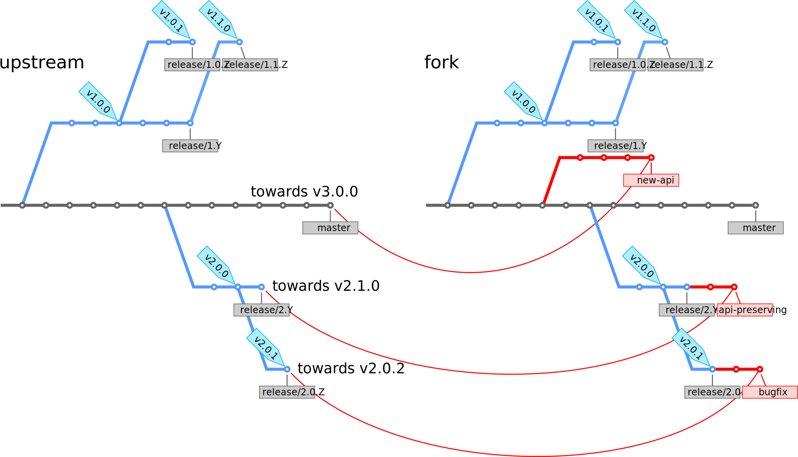

# Semantic branching model

## Version: 1.0.0-alpha-1

## License

Made available under the
[Creative Commons Attribution-ShareAlike license](https://creativecommons.org/licenses/by-sa/4.0/).

## Authors

- [Roberto Di Remigio](https://totaltrash.xyz)
- [Radovan Bast](http://bast.fr)

## Assumptions for a project using the semantic branching model

* The project uses [semantic versioning](http://semver.org).
* The project strictly adheres to a fork-and-pull-request (or fork-and-merge-request) workflow.

## Goals

- Separate development towards major, minor, or patch release.
- Communicate to contributors the meaning and effect of each branch.
- Communicate to maintainers the release visibility intent of each patch.
- Make it clear and simple to decide both for contributors and maintainers
  whether patches affect the next major, minor, or patch version.

## Why not just using [A successful Git branching model](http://nvie.com/posts/a-successful-git-branching-model/)?

- In the [Vincent Driessen model](http://nvie.com/posts/a-successful-git-branching-model/)
  every commit on master is a new release by definition but publishing patches to
  past releases leads to release commits which are not on master.
- The [Vincent Driessen model](http://nvie.com/posts/a-successful-git-branching-model/) model
  offers no protocol for discriminating feature pull requests (PRs) based on
  their target major or minor version. For maintainers it may therefore be
  difficult to accept an API-preserving feature PR after having accepted an
  API-breaking feature PR. For contributors it may be difficult to communicate
  the release visibility intent of a patch.

## Branch semantics

1. `master` collects changes towards the next **major** release.
3. `release/X.Y` branches collect changes towards the next **minor** release.
3. `release/X.Y.Z` branches collect changes towards the next **patch** release.
4. New features are directed either towards `master` or towards `release/X.Y` branches.
5. Patch release branches `release/X.Y.Z` never receive new features, they only receive bugfixes.

## Lifetime of branches

- When a new release branch is created, support for previous versions can be
  dropped.
- Bugfixes to previous versions are only released if a suitable PR addresses
  them.

## Release preparation

The release process consists of the following steps: feature freeze, converging
a release candidate, and tagging a release.

### Feature freeze and branch creation

Feature freeze is the moment when a new release branch is created, either
`release/X.Y` is created from master, or `release/X.Y.Z` is created from
`release/X.Y`. The creation of a release branch may be delayed up to the
moment until the root branch receives changesets towards the next major or
minor release.

### Converging a release candidate

Often some work needs to be done between a feature freeze and arriving at the
release commit: this work typically consists of bugfixes, cosmetics, documentation,
together with testing.

### Tagging a release

Tagging a specific commit with a release version creates the actual release.
We recommend to use annotated tags because they contain the author of the tag.

## Bugfixes

- Bugfixes can be directed either towards `release/X.Y.Z`, or `release/X.Y`, or
  `master`, depending on the intent.
- Bugfixes directed towards `release/X.Y.Z` require to bump the patch number,
  signalled by creating a new tag.
- Important bugfixes in a given `release/X.Y.Z` can, if necessary, be ported
  to `release/X.Y` and further to `master` by merging.
- Important bugfixes in `master` can, if necessary, be ported to `release/X.Y` and
  `release/X.Y.Z` by _cherry picking_.

## Source branch

A pull request (PR) PRs from any fork should never start from the branch to which they are
directed in the upstream repository.

Explanation:

- Avoid having unrelated commits stacked on top of your PR before it gets integrated
  (see also [this blogpost](http://blog.jasonmeridth.com/posts/do-not-issue-pull-requests-from-your-master-branch/)).
- The submitted changes may get rebased and/or squashed by the maintainer and
  this could create divergence and merge commits on the source branch which
  could complicate future pull requests.

Example:

- To submit a PR towards `release/1.0.Z` fixing issue 137, fork the repository,
  and in the fork create a branch `release/1.0.Z-issue-137` from
  `release/1.0.Z` and submit PR towards the upstream `release/1.0.Z`. Branch
  `release/1.0.Z-issue-137` can be deleted after the PR is accepted.

## Target branch

- **Bugfix PRs** are directed towards the relevant `release/X.Y.Z` upstream branch.
- **API-preserving feature PRs** can be directed either to `master` (then they are scheduled for the next major release)
  or to the corresponding release branch (then they are scheduled for the next minor release) and then ported to `master`.
- **API-breaking feature PRs** are directed towards the `master` upstream branch.

## Frequently-asked questions

### Do I need release branches at all? Can't we just tag releases on master?

If you never want to release patches to released versions, tagging versions on
`master` is probably sufficient.  The moment your project receives patches to
released versions, you need to create branches.

### My project does not use [semantic versioning](http://semver.org), does this model still make sense?

This model probably still makes sense but you probably do not need two levels of release branches
but probably require only one supporting each release.

### My project does not use fork-and-pull-request workflow, does this model still make sense?

You can employ this model also within a single repository. For this
write-protect `master` and release branches and employ code review before
accepting merges from feature or bugfix branches towards either `master` or
release branches.

### Will my project not end up with many branches?

Possibly - but branches are cheap. If you do not like to have a branch for each
single release, you can delay the creation of a corresponding release branch
until the moment when a past release is about to receive a patch which you
would like to isolate from other changes which have the past release as parent.
